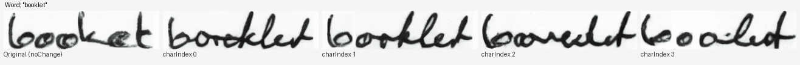

# Beyond Memorization: Training-Free Style Mixing for Variability in Handwritten Text Generation Using Writer Embedding Injection in Pretrained Diffusion Models

**ICDAR 2025** — Published in *Document Analysis and Recognition – ICDAR 2025*, Springer Nature Switzerland, pp. 465–484.

<p align='center'>
  <b>
    <a href="https://doi.org/10.1007/978-3-032-04627-7_27">Paper (Springer)</a>
  </b>
</p>

> **Abstract:**
> Recent advancements in handwritten text generation using diffusion models have achieved high-quality and realistic handwriting synthesis. However, existing models often suffer from limited style variability, which reduces their effectiveness for downstream tasks like handwriting recognition and writer identification, which rely on diverse handwriting samples to ensure model generalization and robustness. Without sufficient variability, models trained on synthetic data risk overfitting to a narrow set of styles, limiting their applicability in real-world scenarios.

---

## Style Variability — Side-by-Side Comparison

Each row shows the **same word** generated with progressively more style mixing. Left is the original writer style; right columns inject a different writer's embedding at increasing character positions:



> Each frame = one word. Columns left→right: **Original** | **charIndex 0** | **charIndex 1** | **charIndex 2** | **charIndex 3**

---

## Attention Map Visualization

Per-character attention maps showing how the model localizes each character:


---

## Method Overview

- **Base model:** [WordStylist](https://github.com/koninik/WordStylist) — pretrained latent diffusion model for styled handwritten word generation (ICDAR 2023)
- **Our contribution:** Training-free style mixing at inference time using character-level attention map localization and writer embedding injection
- **Key idea:** For a word with *N* characters, the U-Net attention maps identify each character's spatial region (`max_x_coords`). At each ResBlock, the original writer's embedding is applied left of character `i`, and a randomly selected writer's embedding is applied right of character `i` — producing progressively varied styles without any retraining

The injection formula: **h = mask × emb_original + mask1 × emb_shuffled** where mask/mask1 are derived from the attention-based character position `max_x_coords[:, charIndx]`

---

## Assumptions

| # | Assumption | Detail |
|---|-----------|--------|
| 1 | **CUDA GPU** | Requires CUDA-capable GPU. Set `device = "cuda:0"` in `config.py` |
| 2 | **IAM dataset preprocessed** | Word images cropped and resized to **64×256 px** grayscale PNG |
| 3 | **WordStylist EMA model** | `ema_ckpt.pt` downloaded and passed via `--model_path` |
| 4 | **HTR/OCR model** | Pretrained HTR `.pt` file for word filtering via `--loadPrevPath` |
| 5 | **Stable Diffusion v1.5** | Local copy needed for VAE. Pass root dir via `--stable_dif_path` (must contain `vae/` subfolder). Download: `git clone https://huggingface.co/stable-diffusion-v1-5/stable-diffusion-v1-5` |
| 6 | **Python 3.8** | Tested on Python 3.8, PyTorch 2.4.1+CUDA 12.1 |
| 7 | **MAX_CHARS = 25** | Words longer than 25 chars are skipped |
| 8 | **GT file included** | `gt/gany.filter27` is included in this repo |

---

## Requirements

```bash
pip install -r requirements.txt
```

---

## Setup

### Step 1 — Download pretrained models

| Model | Download | Pass as |
|-------|----------|---------|
| WordStylist EMA | [Google Drive](https://drive.google.com/file/d/1XVRUXSJw0PaNgrtFH_mNHceFO-Ouf_xz/view?usp=share_link) | `--model_path` |
| HTR/OCR model | [HTR best practices](https://github.com/georgeretsi/HTR-best-practices) | `--loadPrevPath` |
| Stable Diffusion v1.5 | `git clone https://huggingface.co/stable-diffusion-v1-5/stable-diffusion-v1-5` | `--stable_dif_path` |

### Step 2 — Prepare IAM dataset

```bash
python prepare_images.py   # edit iam_path and save_dir inside first
```

### Step 3 — Run inference

```bash
python regFrmTrnVariStyleMixOcr.py \
  --iam_path        /path/to/iam/word/crops/           \
  --model_path      /path/to/ema_ckpt.pt               \
  --loadPrevPath    /path/to/htr_model.pt              \
  --stable_dif_path /path/to/stable-diffusion-v1-5/   \
  --save_path       ./output/                          \
  --batch_size 4 --epochs 1
```

---

## Output Structure

```
output/
├── noChange/                  ← Original writer style (baseline)
│   ├── word_0.png
│   └── attentionMaps/         ← Per-character attention maps
│       ├── word_0_c_0_....png
│       └── ...
├── charIndex_0/               ← Style mixed starting at character 0
│   └── attentionMaps/
├── charIndex_1/               ← Style mixed starting at character 1
│   └── attentionMaps/
├── charIndex_2/               ← Style mixed starting at character 2
│   └── attentionMaps/
└── charIndex_3/               ← Style mixed starting at character 3
    └── attentionMaps/
```

Compare the **same word** across `noChange/` and `charIndex_*/` folders to observe style variability.

**Filename format:**
```
{imageID}_{writerID}_{shuffledWriterID}_New__{word}_{epoch}.png
```

---

## Citation

```bibtex
@InProceedings{10.1007/978-3-032-04627-7_27,
  author="Gurav, Aniket and Chanda, Sukalpa and Krishnan, Narayanan C.",
  editor="Yin, Xu-Cheng and Karatzas, Dimosthenis and Lopresti, Daniel",
  title="Beyond Memorization: Training-Free Style Mixing for Variability in Handwritten Text Generation Using Writer Embedding Injection in Pretrained Diffusion Models",
  booktitle="Document Analysis and Recognition -- ICDAR 2025",
  year="2026",
  publisher="Springer Nature Switzerland",
  address="Cham",
  pages="465--484",
  isbn="978-3-032-04627-7"
}
```

---

## Code Credits

Built on top of **WordStylist** ([koninik/WordStylist](https://github.com/koninik/WordStylist)).

```bibtex
@article{nikolaidou2023wordstylist,
  title={{WordStylist: Styled Verbatim Handwritten Text Generation with Latent Diffusion Models}},
  author={Nikolaidou, Konstantina and Retsinas, George and Christlein, Vincent and Seuret, Mathias and Sfikas, Giorgos and Smith, Elisa Barney and Mokayed, Hamam and Liwicki, Marcus},
  journal={arXiv preprint arXiv:2303.16576},
  year={2023}
}
```

Also thanks to [Stable Diffusion](https://github.com/CompVis/stable-diffusion), [HTR best practices](https://github.com/georgeretsi/HTR-best-practices), and [GANwriting](https://github.com/omni-us/research-GANwriting).
