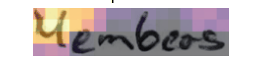

# Beyond Memorization: Training-Free Style Mixing for Variability in Handwritten Text Generation Using Writer Embedding Injection in Pretrained Diffusion Models

**ICDAR 2025** — Published in *Document Analysis and Recognition – ICDAR 2025*, Springer Nature Switzerland, pp. 465–484.

<p align='center'>
  <b>
    <a href="https://doi.org/10.1007/978-3-032-04627-7_27">Paper (Springer)</a>
  </b>
</p>

> **Abstract:**
> Recent advancements in handwritten text generation using diffusion models have achieved high-quality and realistic handwriting synthesis. However, existing models often suffer from limited style variability, which reduces their effectiveness for downstream tasks like handwriting recognition and writer identification, which rely on diverse handwriting samples to ensure model generalization and robustness. Without sufficient variability, models trained on synthetic data risk overfitting to a narrow set of styles, limiting their applicability in real-world scenarios.

---

## Attention Map Visualization

Per-character attention maps showing how the model localizes each character in the generated word image:



Each frame shows the attention map for one character overlaid on the generated word image. These maps are used to spatially inject a different writer's style at the character level.

---

## Method Overview

- **Base model:** [WordStylist](https://github.com/koninik/WordStylist) — pretrained latent diffusion model for styled handwritten word generation (ICDAR 2023)
- **Our contribution:** Training-free style mixing using character-level attention map localization and writer embedding injection
- **No retraining required** — runs purely at inference time on the pretrained WordStylist model

---

## Assumptions

> These are the assumptions made by this implementation. Make sure they are satisfied before running.

| # | Assumption | Detail |
|---|-----------|--------|
| 1 | **CUDA GPU available** | Requires a CUDA-capable GPU. Set `device = "cuda:0"` in `config.py` |
| 2 | **IAM dataset preprocessed** | Word images must be cropped and resized to **64×256 px** grayscale PNG crops |
| 3 | **WordStylist pretrained model** | EMA model `ema_ckpt.pt` downloaded from WordStylist, passed via `--model_path` |
| 4 | **HTR/OCR model** | Pretrained HTR `.pt` file for word filtering, passed via `--loadPrevPath` |
| 5 | **Stable Diffusion v1.5 (VAE)** | Local copy of [SD v1.5](https://huggingface.co/stable-diffusion-v1-5/stable-diffusion-v1-5) needed for the VAE encoder/decoder. Pass the root directory via `--stable_dif_path`. It must contain a `vae/` subfolder |
| 6 | **Python 3.8** | Tested on Python 3.8 with PyTorch 2.4.1+CUDA 12.1 |
| 7 | **MAX_CHARS = 25** | Maximum word length is 25 characters. Words longer than 25 chars are skipped |
| 8 | **GT file included** | `gt/gany.filter27` (IAM training word list) is included in this repo |

---

## Requirements

```bash
pip install -r requirements.txt
```

Key packages: `torch>=2.4.1`, `diffusers>=0.35.1`, `transformers>=4.46.3`, `einops`, `timm`, `scikit-image`

---

## Setup

### Step 1 — Download pretrained models

| Model | Download | Pass as |
|-------|----------|---------|
| WordStylist EMA model | [Google Drive](https://drive.google.com/file/d/1XVRUXSJw0PaNgrtFH_mNHceFO-Ouf_xz/view?usp=share_link) | `--model_path /path/to/ema_ckpt.pt` |
| HTR/OCR model | [HTR best practices](https://github.com/georgeretsi/HTR-best-practices) | `--loadPrevPath /path/to/htr_model.pt` |
| Stable Diffusion v1.5 | `git clone https://huggingface.co/stable-diffusion-v1-5/stable-diffusion-v1-5` | `--stable_dif_path /path/to/stable-diffusion-v1-5/` |

> **Note on Stable Diffusion:** Only the `vae/` subfolder is used. The directory must contain `vae/config.json` and `vae/diffusion_pytorch_model.bin`.

### Step 2 — Prepare IAM dataset

Download `data/words.tgz` from [IAM Handwriting Database](https://fki.tic.heia-fr.ch/databases/iam-handwriting-database), then preprocess to 64×256 px PNG crops:

```bash
python prepare_images.py  # edit iam_path and save_dir inside first
```

### Step 3 — Run inference

```bash
python regFrmTrnVariStyleMixOcr.py \
  --iam_path       /path/to/iam/word/crops/            \
  --model_path     /path/to/ema_ckpt.pt                \
  --loadPrevPath   /path/to/htr_model.pt               \
  --stable_dif_path /path/to/stable-diffusion-v1-5/   \
  --save_path      ./output/                           \
  --batch_size 4 --epochs 1
```

---

## Output: Where to Find Generated Images and Attention Maps

After running, all outputs are under `--save_path`:

```
output/
└── noChange/                        ← Generated word images
    │   a03-034-01-03_049_116_New__called_0.png
    │   ...
    └── attentionMaps/               ← Per-character attention map visualizations
            ..._called_0_c_0_char_att0_val2_rollMins4.png   ← char 0 = 'c'
            ..._called_1_a_0_char_att0_val2_rollMins4.png   ← char 1 = 'a'
            ..._called_2_l_0_char_att0_val2_rollMins4.png   ← char 2 = 'l'
            ...
```

**Filename format — word images:**
```
{imageID}_{originalWriterID}_{shuffledWriterID}_New__{word}_{epoch}.png
```

**Filename format — attention maps:**
```
{imageID}_{writerIDs}_New__{word}_{charIndex}_{charLetter}_char_att0_val2_rollMins4.png
```

For each generated word, you get **one attention map per character**.

---

## Citation

```bibtex
@InProceedings{10.1007/978-3-032-04627-7_27,
  author="Gurav, Aniket and Chanda, Sukalpa and Krishnan, Narayanan C.",
  editor="Yin, Xu-Cheng and Karatzas, Dimosthenis and Lopresti, Daniel",
  title="Beyond Memorization: Training-Free Style Mixing for Variability in Handwritten Text Generation Using Writer Embedding Injection in Pretrained Diffusion Models",
  booktitle="Document Analysis and Recognition -- ICDAR 2025",
  year="2026",
  publisher="Springer Nature Switzerland",
  address="Cham",
  pages="465--484",
  isbn="978-3-032-04627-7"
}
```

---

## Code Credits

Built on top of **WordStylist** ([koninik/WordStylist](https://github.com/koninik/WordStylist)). The base diffusion model, U-Net architecture, and dataset pipeline are from WordStylist. We extend it with training-free style mixing at inference time.

```bibtex
@article{nikolaidou2023wordstylist,
  title={{WordStylist: Styled Verbatim Handwritten Text Generation with Latent Diffusion Models}},
  author={Nikolaidou, Konstantina and Retsinas, George and Christlein, Vincent and Seuret, Mathias and Sfikas, Giorgos and Smith, Elisa Barney and Mokayed, Hamam and Liwicki, Marcus},
  journal={arXiv preprint arXiv:2303.16576},
  year={2023}
}
```

Also thanks to [Stable Diffusion](https://github.com/CompVis/stable-diffusion), [HTR best practices](https://github.com/georgeretsi/HTR-best-practices), and [GANwriting](https://github.com/omni-us/research-GANwriting).
